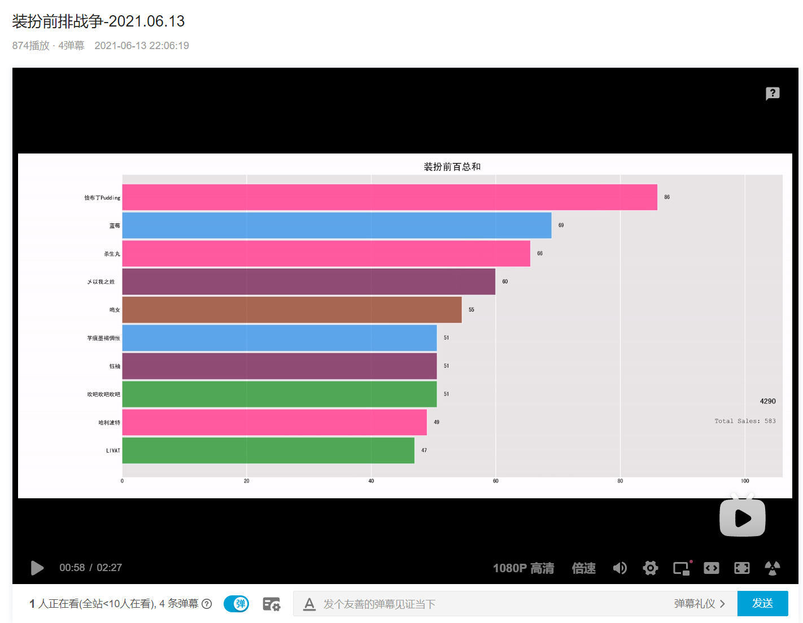

# Garb bar chart race
装扮是 bilibili 提供的一种个性化装饰，包括主题、表情包、空间背景等。

本项目为[装扮前排战争-2021.06.13_哔哩哔哩_bilibili](https://www.bilibili.com/video/BV1664y167W4)视频对应的代码项目, 是一个装扮的跑马图(bar chart race), 展示了到 2021.06.13 的装扮前百/前十拥有者.

[](https://www.bilibili.com/video/BV1664y167W4)


## 文件说明

gart_top.py 用于生成跑马图的脚本

get_data.py 用于获取前百装扮项目的脚本, 会将数据存储为 test.csv, 但是由于相关 API 已失效, 所以无法使用了, 这里保留了当时生成 test.csv 用于演示


## 其他

- 关于 bar_chart_race 库无法显示中文的解决方案:

目前使用了 bar_chart_race_cn, 实际还有更简单的解决版本, 在`_make_chart.py`

```
plt.rcParams['font.sans-serif'] = ['SimHei'] #Windows
plt.rcParams['font.sans-serif'] = ['Arial Unicode MS'] #Mac (注意不要都写,以免覆盖了)
plt.rcParams['axes.unicode_minus'] = False
```


- 视频生成所需要使用的编码器:

https://www.ffmpeg.org/download.html
